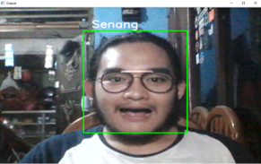

# Pendeteksian Wajah Dengan Python dan Pustaka

## Pendahuluan

Proyek ini bertujuan untuk mengklasifikasikan emosi di wajah seseorang menjadi salah satu dari **Tujuh Kategori/Ekspresi** , menggunakan jaringan saraf konvolusional yang dalam. Model ini dilatih pada kumpulan data **FER-2013** yang dipublikasikan di International Conference on Machine Learning (ICML). Dataset ini terdiri dari 35887 grayscale, gambar wajah berukuran 48x48 dengan **Tujuh Emosi** - marah, jijik, takut, senang, netral, sedih dan terkejut.

## Dependensi atau alat dan pustaka yang digunakan

- [Python 3](https://www.python.org/downloads/release/python-380/), [OpenCV](https://opencv.org/), [Tensorflow](https://www.tensorflow.org/)
- Langkah awalan utuk menjalankan program ketikan perintah berikut di dalam terminal
  `pip install -r requirements.txt`.

## Penggunaan Dasar

Repositori saat ini kompatibel dengan `tensorflow-2.3.1` dan menggunakan API Keras menggunakan `tensorflow.keras` pustaka.

- Download the FER-2013 dataset from [here](https://drive.google.com/file/d/1X60B-uR3NtqPd4oosdotpbDgy8KOfUdr/view?usp=sharing) and unzip it inside the `src` folder. This will create the folder `data`.

- Jika ingin melatih kumpulan data (model), ketikan:

```bash
python main.py --mode train
```

- Jika ingin melihat prediksi/hasil tanpa pelatihan lagi, Anda dapat mendownload model terlatih dari sini dan kemudian menjalankan:

```bash
python main.py --mode display
```

- Struktur Folder:  
  src:

  - data (folder)
  - `main.py` (file)
  - `dataset_prepare.py` (file)
  - `haarcascade_frontalface_default.xml` (file)
  - `model.h5` (file)
  - `requirements.txt` (file)

- Penerapan ini secara default mendeteksi emosi pada semua wajah di umpan webcam. Dengan CNN 4-lapis sederhana, akurasi pengujian mencapai 63,2% dalam 50 epoch.


## Persiapan Data (opsional jika ingin melatih data dengan kumpulan data sendiri)

- The [dataset FER2013 asli dalam Kaggle](https://www.kaggle.com/deadskull7/fer2013) tersedia sebagai file csv tunggal. Saya telah mengonversi menjadi kumpulan data gambar dalam format PNG untuk pelatihan / pengujian dan memberikan ini sebagai kumpulan data di bagian sebelumnya.

- ika Anda ingin bereksperimen dengan kumpulan data baru, Anda mungkin harus berurusan dengan data dalam format csv. Saya telah memberikan kode yang saya tulis untuk preprocessing data di `dataset_prepare.py` file yang dapat digunakan untuk referensi.

## Algoritma

- Pertama, metode **haar cascade** digunakan untuk mendeteksi wajah di setiap bingkai dari umpan webcam.

- Wilayah gambar yang berisi wajah diubah ukurannya menjadi **48x48** dan diteruskan sebagai input ke CNN.

- Jaringan mengeluarkan daftar **skor softmax** untuk tujuh kelas emosi.

- Emosi dengan skor maksimal ditampilkan di layar.

## Example Output



## References Program

- "Challenges in Representation Learning: A report on three machine learning contests." I Goodfellow, D Erhan, PL Carrier, A Courville, M Mirza, B
  Hamner, W Cukierski, Y Tang, DH Lee, Y Zhou, C Ramaiah, F Feng, R Li,  
   X Wang, D Athanasakis, J Shawe-Taylor, M Milakov, J Park, R Ionescu,
  M Popescu, C Grozea, J Bergstra, J Xie, L Romaszko, B Xu, Z Chuang, and
  Y. Bengio. arXiv 2013.
